# Twitch: AWS Deployment

Deploy the React frontend and Spring Boot backend as one container with Amazon RDS, ECR, and ECS Express Mode.

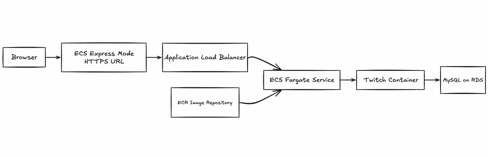

## 1. Prerequisites

Install and configure:

- Node.js 16 and npm
- JDK 21 with a valid `JAVA_HOME`
- Docker Desktop
- [AWS CLI v2](https://docs.aws.amazon.com/cli/latest/userguide/getting-started-install.html)
- An AWS account
- A Twitch client ID and client secret

Record these values during deployment:

- AWS region
- RDS master username
- RDS master password
- RDS endpoint
- ECR repository base URI
- ECS application URL

Do not add passwords or API credentials to Git.

## 2. Build and integrate the frontend

The frontend source code is available in the [twitch-frontend repository](https://github.com/Oliver-JL/twitch-frontend). Build the frontend first, then copy its production files into the backend so both applications can be deployed in one container.

Open the frontend folder and create a production build:

```bash
cd twitch-frontend
npm install
npm run build
```

Create this folder in the backend if it does not exist:

```text
twitch-backend/src/main/resources/public
```

Copy everything inside `twitch-frontend/build` into that `public` folder. The frontend project is no longer needed for the remaining steps; perform all subsequent operations from the backend root folder.

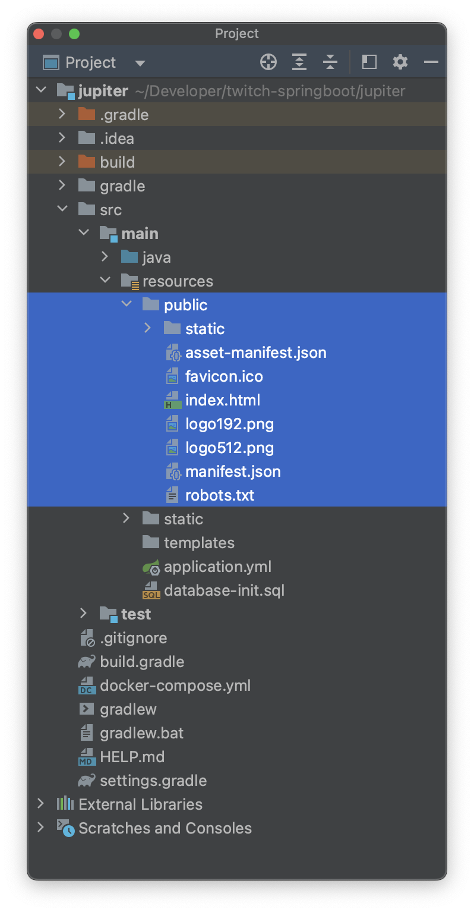

## 3. Select the AWS region

Select one region in the AWS Console and use it for RDS, ECR, and ECS. This guide uses Ohio:

```text
us-east-2
```

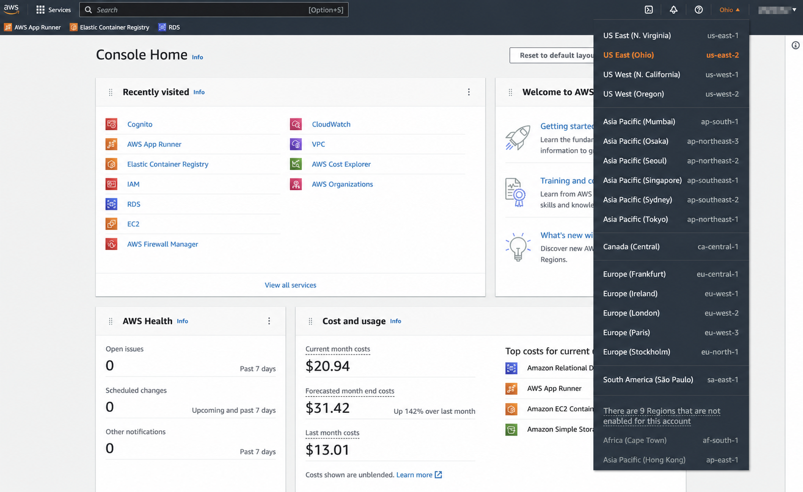

Configure the same region in AWS CLI:

```bash
aws configure set region us-east-2
aws login
aws configure list
```

If AWS CLI is already authenticated, skip `aws login`.

## 4. Create the MySQL security group

Open **EC2 → Security Groups → Create security group** and enter:

| Setting | Value |
|---|---|
| Security group name | `PublicMySqlSecurityGroup` |
| Description | `MySQL security group with default port open` |
| VPC | Default VPC |

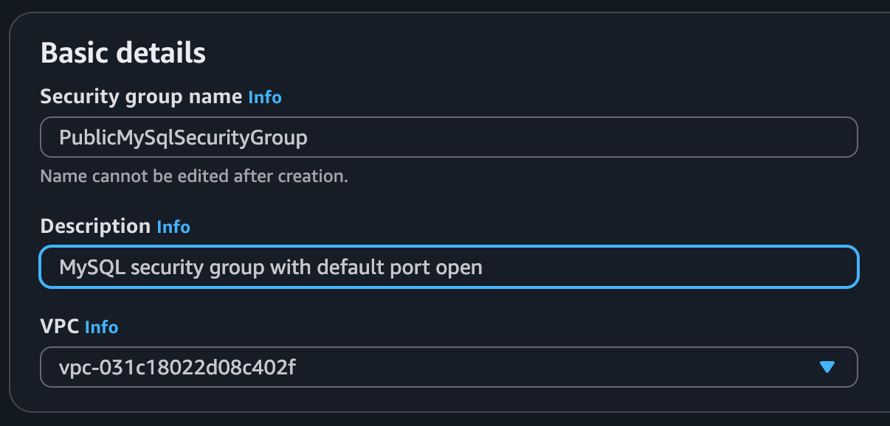

Under **Inbound rules**, add:

| Type | Port | Source |
|---|---:|---|
| MySQL/Aurora | `3306` | Anywhere-IPv4 |

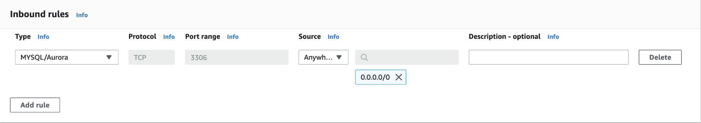

Keep the default outbound rule, then choose **Create security group**.

## 5. Create the RDS database

Open **RDS → Databases → Create database** and choose **Full configuration**.

### Database settings

| Setting | Value |
|---|---|
| Engine | MySQL |
| Template | Free tier |
| Engine version | Default |
| DB instance identifier | Default |
| Master username | `admin` |
| Credentials management | Self managed |
| Password | Create and record a password |

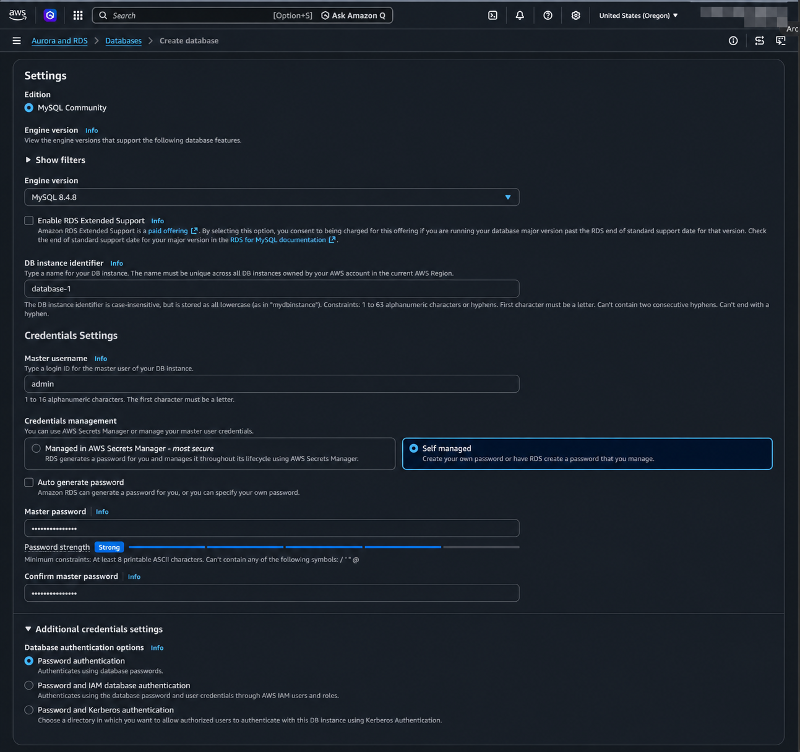

### Instance and storage

| Setting | Value |
|---|---|
| DB instance class | `db.t4g.micro` |
| Allocated storage | `20 GB` |

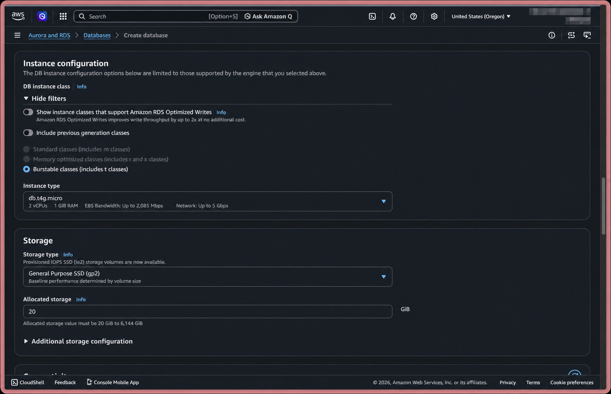

### Connectivity

| Setting | Value |
|---|---|
| VPC | Default VPC |
| Public access | Yes |
| VPC security group | `PublicMySqlSecurityGroup` |

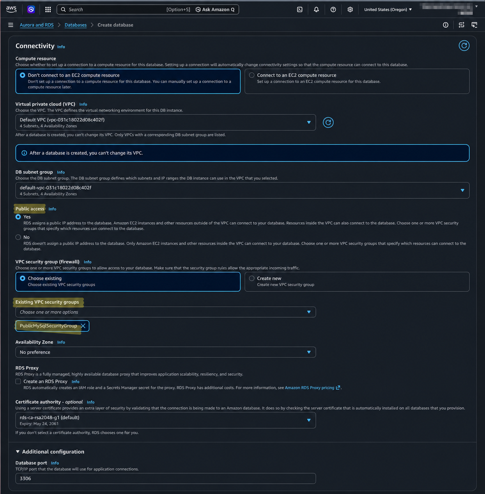

Under **Additional configuration**, set the initial database name to:

```text
twitch
```

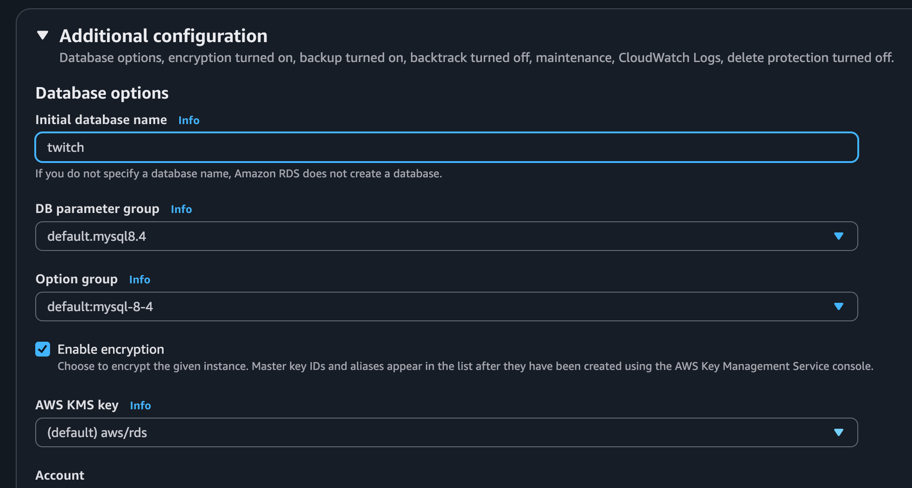

Choose **Create database** and wait until its status becomes **Available**.

Open **Connectivity & security** and record the endpoint. Save only the hostname; do not include `jdbc:mysql://`, `:3306`, or `/twitch`.

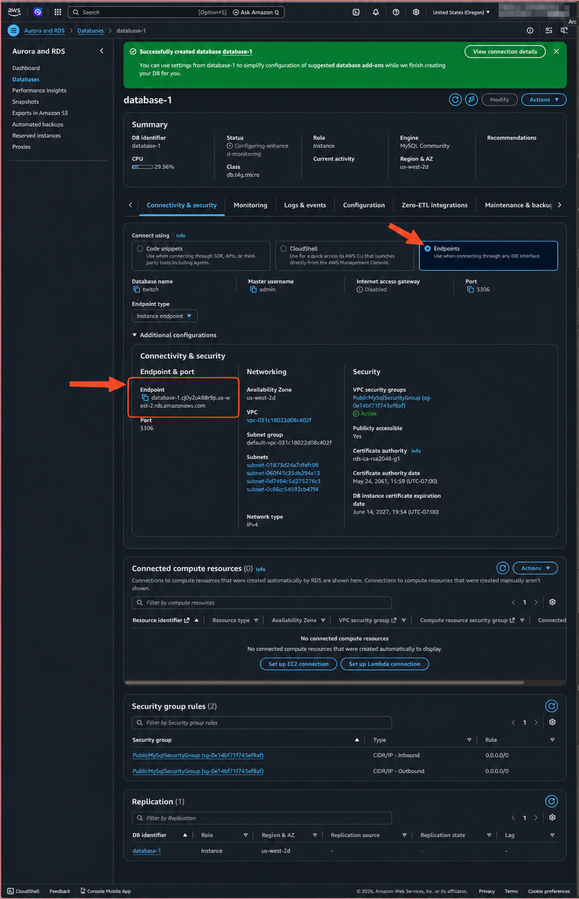

## 6. Initialize the database

In IntelliJ IDEA, open **View → Tool Windows → Database**, then choose **New → Data Source → MySQL**.

| Setting | Value |
|---|---|
| Name | `twitch@rds` |
| Host | RDS endpoint |
| Port | `3306` |
| User | `admin` |
| Password | RDS master password |
| Database | `twitch?createDatabaseIfNotExist=true` |

Test and save the connection.

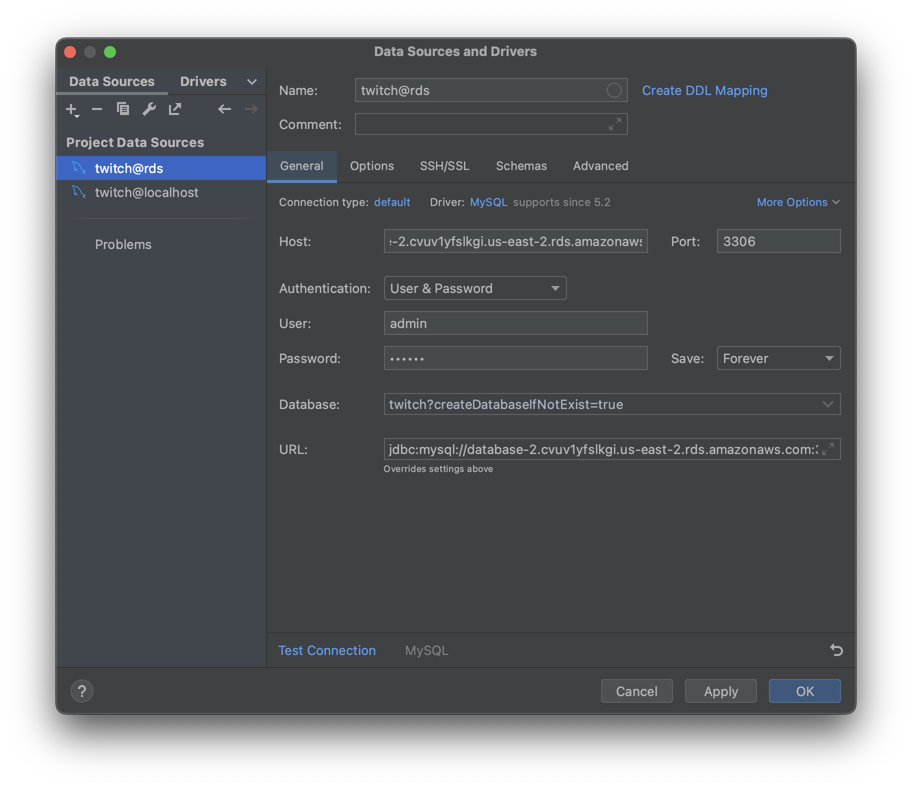

Run `src/main/resources/database-init.sql` once against the new RDS database. The script drops existing tables, so do not run it again after the database contains data.

## 7. Create the ECR repository

Open **ECR → Private repositories → Create repository**.

Set the repository name to:

```text
twitch
```

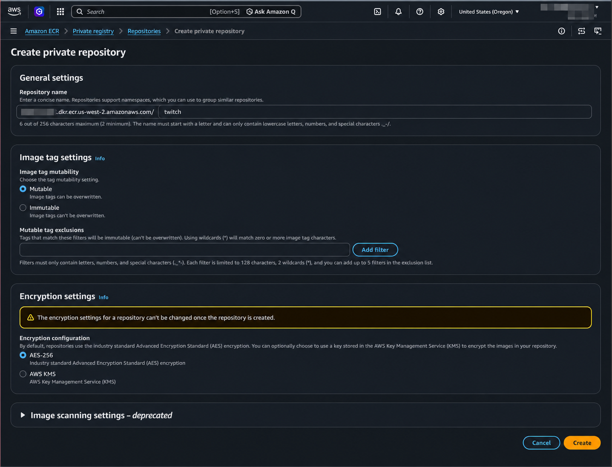

Choose **Create repository** and record its base URI without `/twitch`:

```text
{aws_account_id}.dkr.ecr.{aws_region}.amazonaws.com
```

## 8. Build the container image

Start Docker Desktop.

### Method 1: IntelliJ IDEA

1. Open the **Gradle** panel on the right side of IntelliJ IDEA.
2. Open **twitch → Tasks → build**.
3. Right-click **bootBuildImage** and select **Modify Run Configuration**.

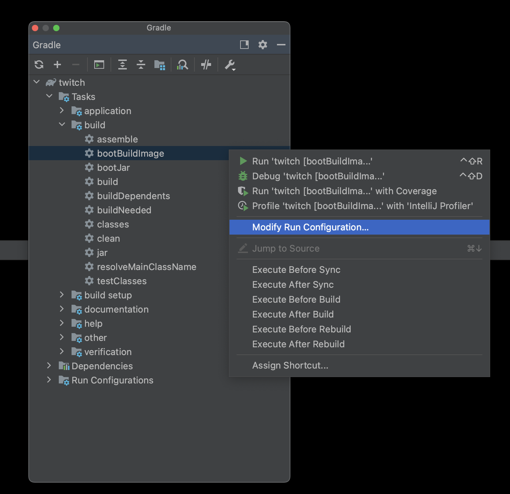

Append these arguments after `bootBuildImage` with a space:

```text
--imageName={repository_base_uri}/twitch:latest --imagePlatform=linux/amd64
```

Replace `{repository_base_uri}` with the ECR base URI recorded in the previous step, then choose **OK**.

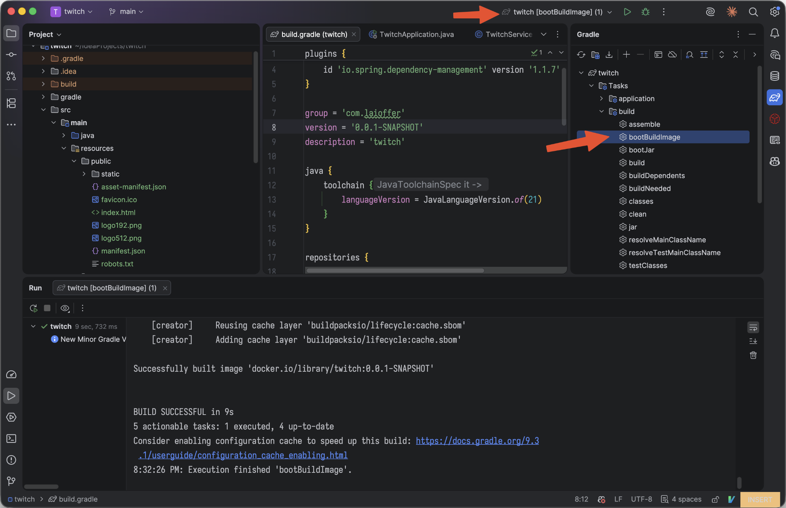

Select the `twitch [bootBuildImage]` run configuration and click the green **Run** button. Wait for `BUILD SUCCESSFUL`.

### Method 2: Command line

Run the appropriate command from the backend root folder.

#### Windows PowerShell

```powershell
.\gradlew.bat bootBuildImage `
  --imageName={repository_base_uri}/twitch:latest `
  --imagePlatform=linux/amd64
```

#### macOS or Linux

```bash
./gradlew bootBuildImage \
  --imageName={repository_base_uri}/twitch:latest \
  --imagePlatform=linux/amd64
```

Replace `{repository_base_uri}` with the ECR base URI recorded in the previous step.

Verify the image architecture:

```bash
docker inspect --format='{{.Architecture}}' {repository_base_uri}/twitch:latest
```

The output must be:

```text
amd64
```

## 9. Push the image to ECR

Authenticate Docker with ECR:

```bash
aws ecr get-login-password --region {aws_region} | docker login --username AWS --password-stdin {repository_base_uri}
```

Expected result:

```text
Login Succeeded
```

Push the image:

```bash
docker push {repository_base_uri}/twitch:latest
```

Open **ECR → Private repositories → twitch** and confirm that the `latest` image exists.

## 10. Deploy with ECS Express Mode

Open **ECS → Express mode**.

### Select the image

1. Choose **Browse ECR images**.
2. Select the private repository `twitch`.
3. Select the image tagged `latest`.

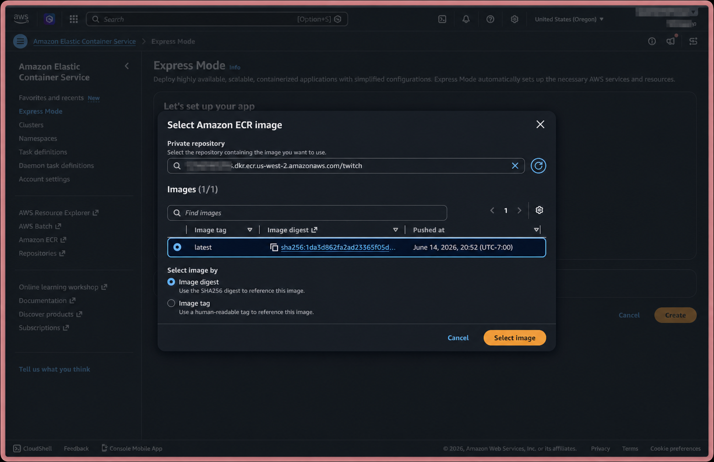

### Configure IAM roles

For the first deployment, choose **Create new role** for:

- Task execution role
- Infrastructure role

If the roles already exist, select:

- `ecsTaskExecutionRole`
- `ecsInfrastructureRoleForExpressServices`

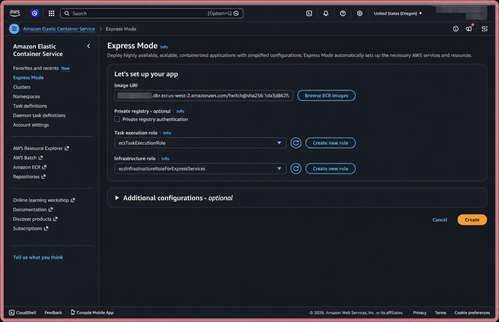

### Configure the service

Open **Additional configurations** and enter:

| Setting | Value |
|---|---|
| Name | `twitch` |
| Container port | `8080` |
| Health check path | `/` |
| CPU | `1 vCPU` |
| Memory | `2 GB` |
| Minimum number of tasks | `1` |
| Maximum number of tasks | `2` |

Add these environment variables:

| Name | Value |
|---|---|
| `DATABASE_URL` | RDS endpoint hostname only |
| `DATABASE_PORT` | `3306` |
| `DATABASE_USERNAME` | RDS master username |
| `DATABASE_PASSWORD` | RDS master password |
| `DATABASE_INIT` | `never` |
| `TWITCH_CLIENT_ID` | Twitch client ID |
| `TWITCH_CLIENT_SECRET` | Twitch client secret |

Leave networking at its default settings and choose **Create**.

If AWS reports `Unable to assume the service linked role`, wait several seconds and choose **Create** again.

## 11. Verify the deployment

Wait until the ECS service status becomes **Active**, then copy its application URL:

```text
https://twitch.ecs.{aws_region}.on.aws/
```

Open the URL and verify:

- The React application loads.
- Registration and login work.
- Popular games and search return data.
- Favorites can be added and removed.
